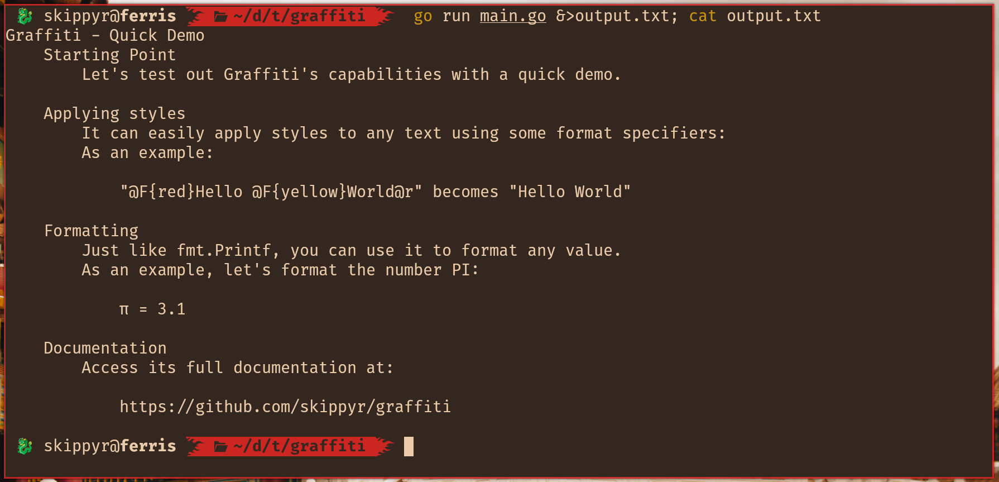

# Graffiti

## Starting Point

Graffiti is a Go module to ease pretty print to standard streams.

## Installation

* Inside of your project's directory, download and include this module.

	```bash
	go get github.com/skippyr/graffiti
	```

* Import it in your code.

	```go
	import (
		"github.com/skippyr/graffiti"
	)
	```

## Usage

Graffiti exists to solve a very common and annoying problem: coloring and formatting the output of programs. This is a hard task, as it envolves dealing with ANSI escape sequences that are hard to debug, as they are invisible when printed.

Not just that, but if your program is piped to other program or redirected to a file, all the ANSI sequences will remain unless you deal to remove them, which will make the output be hard to parse and understand.

### Functions

Graffiti offers some functions to help you:

* `graffiti.Print`: prints to `stdout`.
* `graffiti.Println`: prints to `stdout` and appends a new line character in the end.
* `graffiti.Eprint`: prints to `stderr`.
* `graffiti.Eprintln`: prints to `stderr` and appends a new line character in the end.

Those functions are wrappers of the `fmt.Sprintf` function, which means that you can them to format data just like you would normally do with the `fmt.Printf` function. It also returns the same data types. The difference is that they can interpret new format specifiers to apply styles.

They will automatically replace those format specifiers with styles sequences, or will remove them automatically of the output if they detect that the stream is not a terminal.

To avoid conflicts with some ANSI sequences, those functions will remove ANSI sequences that apply styles, clear the screen or move the cursor from the string you use as parameter.

### Format Specifiers

These are the new format specifiers, that you can use to apply styles. The text placed after one of them will have their style modified:

* `@F{<color>}`: changes the foreground color.
* `@K{<color>}`: changes the background color.
* `@B`: uses bold. Only visible if using a font that contains bold characters. Some terminal emulators might render it using brighter colors.
* `@I`: uses italic. Only visible if using a font that contains italic characters. Some terminal emulators might not render it.
* `@U`: uses underline.
* `@r`: removes all styles applied.
* `@@`: uses an actual `@` character.

The `<color>` placeholder must be replaced by the value of a color of the 8 bits palette (values from `0` to `255` - images of the full palette can be found online and used as reference) or the name of a color of the 3 bits palette:

* `black`: same as value `0`.
* `red`: same as value `1`.
* `green`: same as value `2`.
* `yellow`: same as value `3`.
* `blue`: same as value `4`.
* `magenta`: same as value `5`.
* `cyan`: same as value `6`.
* `white`: same as value `7`.

If the value used is invalid, no style will be applied for that format specifier.

You do not need to reset your styles in the end of the string, as Graffiti automatically does it for you if detects that you have used a style.

Old terminal emulators, have limited capabilities when rendering fonts and colors. If you want your program to support them, avoid using bold and italic, and prefer to use only colors of the 3 bits palette.

### Example

Let's create a simple program to test Graffiti's capabilities.

```go
// File: main.go

package main

import (
	"github.com/skippyr/graffiti"
)

func main() {
	// Prints a colorful "Hello World!".
	graffiti.Println("@F{yellow}Hello @F{green}world@F{magenta}!")

	// Formats and prints a colorful error message.
	errorMsg := "No Such File Or Directory"
	errorOsCode := 2
	graffiti.Eprintln(
		"@F{red}@BError:@r @F{yellow}%s @r(os code @F{red}%d@r).",
		errorMsg,
		errorOsCode,
	)
}
```

Now, let's run this program and see its output:

```bash
go run main.go
```


To see if the sequences will be removed, let's check out what will be put in a file if the output of the program is redirected:

* On Linux:
	```bash
	go run main.go &>output.txt; cat output.txt
	```
* On Windows:
	```powershell
	go run main.go > output.txt 2>&1 & more output.txt
	```



As can be seen, all styles are gone as expected.

## Issues

Report issues through the [issues tab](https://github.com/skippyr/graffiti/issues).

## Contributions

If you want to contribute to this project, check out its [contributions guidelines](https://skippyr.github.io/materials/pages/contributions_guidelines.html).

## License

This project is released under the terms of the MIT license.

Copyright (c) 2023, Sherman Rofeman. MIT License.

