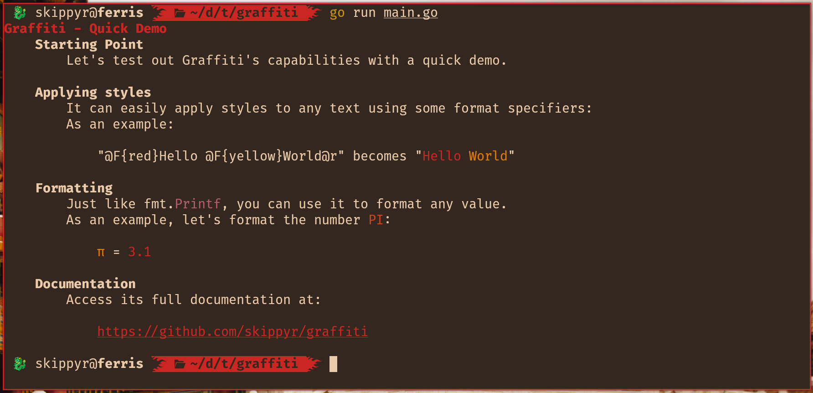

# Graffiti

## Starting Point

The Graffiti project is a module for the Go Lang that aims to easy pretty
printing to standard streams by using new format specifiers to create ANSI
escape sequences. It includes support for Windows and UNIX-like operating
systems.

## Installation

The latest stable version of Graffiti can be included in any Go project, by
following these steps:

* Inside of your project's directory, download and include this module.

```bash
go get github.com/skippyr/graffiti
```

* Whenever you need it, import it in your code inside of an `import` rule on
  the top of that file.

```go
import (
    "github.com/skippyr/graffiti"
)
```

## Usage

### Functions

Graffiti offers these functions to help you print a string into a standard
stream:

* `graffiti.Print`: prints to `stdout`.
* `graffiti.Println`: prints to `stdout` and appends a new line character in
  the end.
* `graffiti.Eprint`: prints to `stderr`.
* `graffiti.Eprintln`: prints to `stderr` and appends a new line character in
  the end.
* `graffiti.EscapePrefixCharacters`: escapes all occurences of prefixes
   characters used to identify format specifiers from a string. This make it
   able to be printed as a regular text.

Those functions are wrappers of the `fmt.Sprintf` function, which means that
you can them to format data just like you would normally do with the
`fmt.Printf` function. It also returns the same data types. The difference is
that they can interpret new format specifiers to apply styles.

They will automatically replace those format specifiers with a respective ANSI
sequences, or will remove them automatically of the output if they detect that
the stream is being piped or redirected to a file.

To avoid conflicts with some ANSI sequences, those functions will remove ANSI
sequences that apply styles, clear the screen and move the cursor from the
string you use as parameter.

### Format Specifiers

These are the new format specifiers that you can use to apply styles. The text
placed after one of them will have their style modified:

* `@F{<color>}`: changes the foreground color.
* `@K{<color>}`: changes the background color.
* `@B`: uses bold. Only visible if using a font that contains bold characters.
  Some terminal emulators might render it using brighter colors.
* `@I`: uses italic. Only visible if using a font that contains italic
  characters. Some terminal emulators might not render it.
* `@U`: uses underline.
* `@r`: removes all styles applied.
* `@@`: escapes formatting checking and uses an actual `@` character.

The `<color>` placeholder must be replaced by the value of a color of the 8 bits
palette (values from `0` to `255`), here is a reference:


Or it can be the name of a color of the 3 bits palette:

* `black`: same as value `0`.
* `red`: same as value `1`.
* `green`: same as value `2`.
* `yellow`: same as value `3`.
* `blue`: same as value `4`.
* `magenta`: same as value `5`.
* `cyan`: same as value `6`.
* `white`: same as value `7`.

If the value used is invalid, no style will be applied for that format
specifier.

You do not need to reset your styles in the end of the string, as Graffiti
automatically does it for you if detects that you have used a style.

Old terminal emulators have limited capabilities when rendering fonts and
colors. If you want your program to support them, avoid using bold and italic,
and prefer to use only colors of the 3 bits palette.

### Example

Let's create a simple demo program to test Graffiti's capabilities.

```go
// File: main.go

package main

import (
    "github.com/skippyr/graffiti"
)

func main() {
    graffiti.Println("@B@F{red}Graffiti - Quick Demo")
    graffiti.Println("    @BStarting Point")
    graffiti.Println("        Let's test out Graffiti's capabilities with a quick demo.")
    graffiti.Println("")

    graffiti.Println("    @BApplying styles")
    graffiti.Println("        It can easily apply styles to any text using some format specifiers:")
    graffiti.Println("        As an example:")
    graffiti.Println("")

    text := "@F{red}Hello @F{yellow}World@r"

    graffiti.Println("            \"%s\" becomes \"%s\"", graffiti.EscapePrefixCharacters(text), text)
    graffiti.Println("")
    graffiti.Println("    @BFormatting")
    graffiti.Println("        Just like fmt.@F{magenta}Printf@r, you can use it to format any value.")
    graffiti.Println("        As an example, let's format the number @F{cyan}PI@r:")
    graffiti.Println("")

    pi := 3.1415

    graffiti.Println("            @F{yellow}π@r = @F{red}%.1f", pi)
    graffiti.Println("")

    graffiti.Println("    @BDocumentation")
    graffiti.Println("        Access its full documentation at:")
    graffiti.Println("")
    graffiti.Println("            @F{red}@Uhttps://github.com/skippyr/graffiti")
}
```

Now, let's run this program and see its output:

```bash
go run main.go
```



To see if the sequences will be removed, let's redirect the output to a file called `output.txt` and see its contents:

* On Unix-like operating systems:

```bash
go run main.go &>output.txt; cat output.txt
```

* On Windows:

```powershell
go run main.go > output.txt 2>&1 & more output.txt
```


As can be seen, all styles are gone as expected.

## Issues And Contributions

Learn how to report issues and contribute to this project by reading its
[contributions guidelines](https://skippyr.github.io/materials/pages/contributions_guidelines.html).

## License

This project is released under the terms of the MIT license. A copy of the
license is bundled with the source code.

Copyright (c) 2023, Sherman Rofeman. MIT license.
